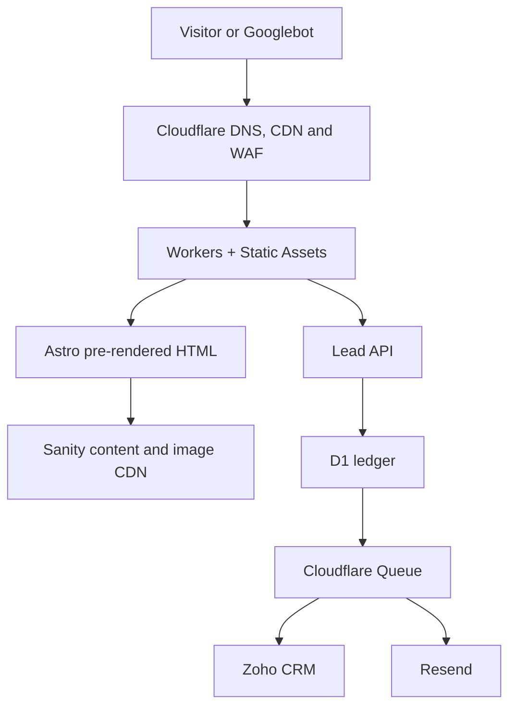
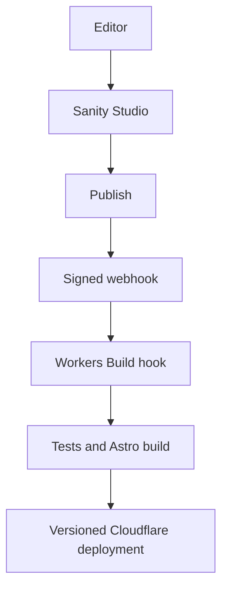
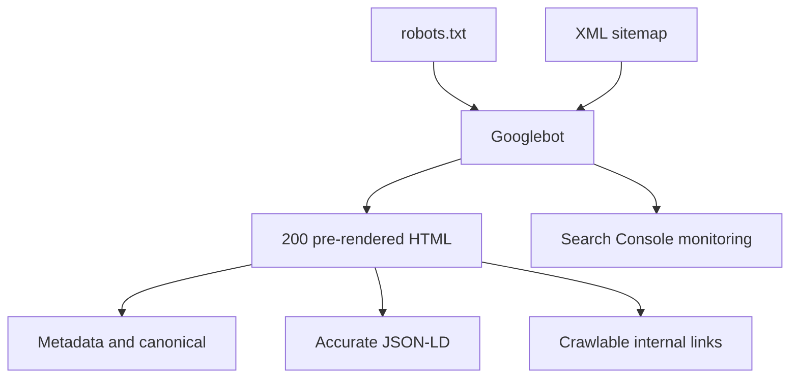
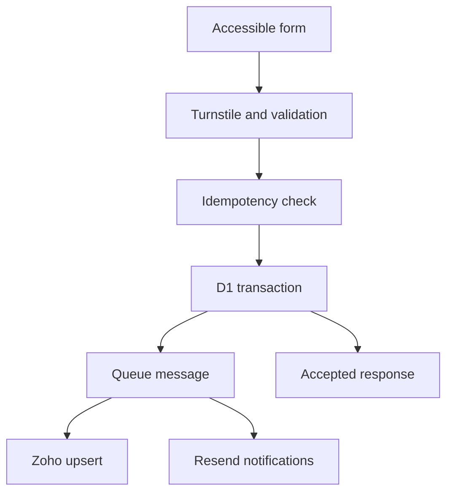

#color Palette
|  # | Color Name           | HEX Code  | RGB                  | Recommended Usage                                   |
| -: | -------------------- | --------- | -------------------- | --------------------------------------------------- |
|  1 | **Primary Orange**   | `#F58220` | `rgb(245, 130, 32)`  | Primary brand color, CTA buttons, links, highlights |
|  2 | **Orange Hover**     | `#DF6F12` | `rgb(223, 111, 18)`  | Button hover, active links, interactive states      |
|  3 | **Light Orange**     | `#FFF1E6` | `rgb(255, 241, 230)` | Light accent backgrounds, badges, highlighted areas |
|  4 | **Primary Charcoal** | `#1A1A1A` | `rgb(26, 26, 26)`    | Headings, navigation, important text                |
|  5 | **Near Black**       | `#111111` | `rgb(17, 17, 17)`    | Footer, dark sections, premium backgrounds          |
|  6 | **Body Gray**        | `#555555` | `rgb(85, 85, 85)`    | Paragraphs and general body text                    |
|  7 | **Muted Gray**       | `#777777` | `rgb(119, 119, 119)` | Secondary text, labels, captions                    |
|  8 | **Border Gray**      | `#E5E5E5` | `rgb(229, 229, 229)` | Borders, separators, card outlines                  |
|  9 | **Warm Off-White**   | `#F8F6F2` | `rgb(248, 246, 242)` | Alternate section backgrounds                       |
| 10 | **Pure White**       | `#FFFFFF` | `rgb(255, 255, 255)` | Main background, cards, text on dark sections       |
| 11 | **Natural Green**    | `#65785F` | `rgb(101, 120, 95)`  | Optional sustainability/natural accent              |

# Orange Offices: WordPress-to-Astro and Cloudflare Production Migration Blueprint

**Site:** https://orangeoffices.in/  
**Plan date:** 29 July 2026  
**Migration type:** CMS, frontend, hosting, lead-system and delivery-platform migration on the same production domain  
**Primary objective:** Remove WordPress without losing URLs, organic-search signals, analytics continuity, media availability or lead flow  
**Final stack:** Astro + TypeScript + Tailwind CSS + Sanity + Cloudflare Workers/Static Assets + D1 + Queues + R2 + Zoho CRM + Resend + Turnstile

---

## 1. Executive decision

### 1.1 Final architecture

| Layer | Final recommendation |
|---|---|
| Framework | **Astro 7 + TypeScript** |
| Rendering | Pre-render public SEO pages at build time; use Worker rendering only for previews, forms, health checks and genuinely request-specific routes |
| UI | Semantic Astro components and CSS by default; small framework-free or React islands only where interaction requires state |
| Styling | Tailwind CSS 4 plus a small first-party design-token layer |
| CMS | **Sanity** structured content, Studio, preview and image pipeline |
| Hosting/CDN/runtime | **Cloudflare Workers + Static Assets** |
| DNS/security | Cloudflare proxied DNS, DNSSEC, TLS, HTTP/3, WAF, rate limiting and Turnstile |
| Canonical origin | `https://orangeoffices.in` |
| URL policy | Preserve existing lower-case paths and trailing slashes |
| Forms | Astro endpoint on Workers → Turnstile → server validation → D1 commit → Queue |
| CRM | **Zoho CRM** is the operational lead and sales system |
| Lead resilience | D1 stores a minimal submission ledger and retry state; it is not a replacement CRM |
| Async integrations | Cloudflare Queue consumer → Zoho CRM and Resend |
| Transactional email | **Resend** for visitor confirmations and internal alerts |
| Legacy media | Cloudflare R2, served at original `/wp-content/uploads/**` paths through the Worker |
| New images | Sanity image CDN with responsive AVIF/WebP generation |
| Analytics | One GTM container owns GA4, Google Ads and approved optional tags |
| Source/deployment | Private GitHub repository → Cloudflare Workers Builds → protected production branch |
| Rollback | Cloudflare deployment rollback plus privately retained WordPress origin for at least 30 days |

### 1.2 Why Cloudflare Workers rather than Vercel

Cloudflare Workers Static Assets can deploy the generated HTML, CSS, JavaScript and Worker code as one versioned unit. Static files are globally cached and, by default, served without invoking application code. Static-asset requests are free and unlimited under the current Workers pricing model. The paid plan has a $5 monthly minimum and includes 10 million dynamic Worker requests, 30 million CPU milliseconds and broader limits for D1, Queues and logs.

Cloudflare Pages remains capable, but a new Orange Offices build should not split the frontend into Pages and its APIs into a separate Worker. Workers provides the same static-delivery economics with a broader feature set, one deployment, one environment model, one rollback target and direct bindings to D1, Queues and R2.

### 1.3 Why Astro rather than Next.js

Orange Offices is primarily a content, service, project, image-gallery and lead-generation website. It does not require an application framework to render every request.

Astro is the better fit because it:

- renders content-heavy pages to crawlable HTML by default;
- ships no component JavaScript unless an island explicitly needs it;
- integrates directly with Cloudflare Workers;
- avoids the OpenNext compatibility layer required to run Next.js on Workers;
- makes the performance budget easier to enforce;
- supports dynamic API and preview routes without turning public pages into SSR;
- remains compatible with Sanity, TypeScript, Tailwind and selective React components.

Next.js on Workers is viable and most features are supported by Cloudflare's OpenNext adapter. It is not selected because Orange Offices would pay the complexity cost without using enough of those features.

### 1.4 Why WordPress should not remain headless

The current site exposes WordPress, Elementor/Elementor Pro, Hello Elementor, Yoast, WP Rocket, Google Site Kit, HubSpot/Leadin, Envato Elements and other WordPress-specific surfaces. A headless implementation would retain:

- the WordPress database and plugin patching burden;
- Elementor-structured content that is difficult to reuse cleanly;
- a second hosting and security surface;
- plugin/API compatibility risks;
- preview and editorial coupling;
- the need to build an entirely new frontend anyway.

WordPress should remain only as:

1. the extraction source;
2. a private content reference;
3. a rollback environment during the acceptance period.

### 1.5 Migration risk

**Risk before inventory: High.**  
**Risk after signed URL, content, media, form, analytics and redirect inventories: Medium.**

The greatest risk is not Astro or Cloudflare. It is changing the CMS, templates, hosting, media delivery, CRM and tracking while the existing site has content inconsistencies and incomplete publicly verifiable crawl data.

---

## 2. Current-state audit

### 2.1 Publicly verified technology and integrations

The live WordPress REST index publicly exposes namespaces associated with:

- WordPress REST API;
- Elementor and Elementor Pro;
- Hello Elementor;
- Yoast SEO;
- WP Rocket;
- Google Site Kit;
- HubSpot/Leadin;
- Envato Elements;
- an image-optimisation plugin;
- All-in-One WP Migration.

Several pages expose a Google Tag Manager iframe. The Privacy Policy states that Google Analytics and Microsoft Clarity are used. This verifies the presence of those systems, but not whether GA4, Google Ads, Clarity or other tags are duplicated between GTM, Site Kit, Elementor, the theme or plugins. The GTM container export and a rendered-source tag audit are mandatory.

### 2.2 Publicly verified information architecture

Primary navigation currently exposes:

- Home
- About
- Services
- Journal
- Blog
- Clients
- Collections
- Contact

Verified service pages:

- `/bespoke-office-interior-design/`
- `/eco-friendly-workspace-design/`
- `/flexible-modular-office-design/`
- `/modern-office-renovation/`

Verified project structure:

- `/collections/`
- `/project/ht-media/`
- `/project/anand-rathi-wealth/`
- `/project/arcelor-mittal/`
- `/project/farmart/`
- `/project/advatix/`
- `/project/fresenius-kabi-india/`
- `/project/dentsu/`
- `/project/wishlink/`
- `/project/cordelia-cruises/`
- `/project/mozaiq/`
- `/project/indxx/`
- `/project/indagro/`
- `/project/pioneer-pro/`
- `/project/razor-group/`

Verified publishing structure:

- `/journal/`
- `/category/all/` is used as the main Blog archive
- article URLs are root-level rather than under `/blog/`

Examples of verified article URLs:

- `/office-interior-design-contracts-guide-delhi-ncr/`
- `/tech-company-office-design-attract-retain-talent-delhi-ncr/`
- `/office-design-budget-breakdown-delhi-ncr-pricing/`
- `/office-renovation-timeline-what-to-expect-during-your-delhi-ncr-office-transformation/`
- `/office-space-planning-calculate-square-footage/`
- `/meeting-room-design-delhi-ncr-hybrid-work/`
- `/office-lighting-design-in-delhi-ncr-beyond-brightness-to-circadian-health-and-performance/`
- `/acoustic-design-open-offices-delhi-ncr/`
- `/biophilic-office-design-in-delhi-ncr-the-science-behind-bringing-nature-indoors-and-why-it-matters-for-your-bottom-line/`
- `/roi-of-great-office-design-culture-productivity/`
- `/modern-office-interior-design-styles/`
- `/office-wall-design-colors-textures-materials/`

Other verified URLs:

- `/about/`
- `/services/`
- `/clients/`
- `/contact/`
- `/gallery/`
- `/privacy-policy/`
- `/terms/`

This is a starter inventory, not the authoritative URL list. It must be reconciled with WordPress, XML sitemaps, Search Console, GA4, logs and backlink data.

### 2.3 Current content, crawl and trust risks

| Finding | Risk | Required handling |
|---|---:|---|
| Navigation markup appears twice in extracted output | Medium | Verify desktop/mobile implementation and emit one semantic navigation tree |
| Proof counters can appear as `0+`, `0 L+` and `0%` in text output | High | Put the real value in HTML; animation may enhance it but may not create it |
| Some public requests returned bot-verification pages | High | Confirm Googlebot is not challenged through URL Inspection and logs; never challenge verified search crawlers |
| `robots.txt` and sitemaps could not be reliably inspected from the audit environment | High | Export the production files and Search Console sitemap list |
| Images use empty/generic alt text or camera filenames | Medium | Preserve existing valid text; separately correct missing/generic values |
| Contact page/footer expose inconsistent phone numbers and email addresses | High | Obtain one approved NAP/contact master before schema and template migration |
| About content includes placeholder-looking team names | High trust risk | Correct or remove in an approved content task before freeze |
| Mozaiq project content mixes conflicting industries, locations and seat counts | High | Resolve the source of truth before import |
| Anand Rathi size renders as `16257.61 8SQft` | Medium | Correct source data before content freeze |
| A renovation URL was observed with an unrelated title | High SEO risk | Confirm title, H1, canonical and intended slug; preserve URL until approved |
| Service pages use conflicting delivery-time claims | High brand/legal risk | Approve one scoped claim model before freeze |
| Public extraction did not reveal complete form fields/workflows | High lead risk | Export HubSpot forms, properties, notifications, consent text and routing |

Do not silently fix business facts during development. Corrections should be approved, applied to the source-of-truth content, frozen and then migrated.

### 2.4 Items requiring owner access

- authoritative URL count;
- current HTTP statuses and redirect chains;
- Yoast sitemap index and child sitemaps;
- page-level canonicals, robots directives and complete schema;
- exact titles, descriptions and H1s;
- Search Console coverage, query, links, sitemap and Core Web Vitals exports;
- GA4/GTM/Ads/Meta/Clarity identifiers, triggers and duplication;
- raw server and Cloudflare logs;
- DNS zone, WAF, redirects, cache and TLS configuration;
- hosting, PHP and database details;
- Elementor templates, global styles and custom CSS/JavaScript;
- `.htaccess`, server and plugin redirects;
- HubSpot forms, properties, lists, workflows, notifications and exports;
- media/PDF inventory and attachment-page behaviour;
- consent-management and legal approval.

### 2.5 Required data pack

Collect before implementation:

1. WordPress administrator and hosting access.
2. Full database dump.
3. `wp-content/uploads`, themes, child themes, `mu-plugins`, plugins and server configuration.
4. WordPress XML export and WP-CLI exports.
5. Search Console: 16 months of Performance, Page Indexing, Sitemaps, Links, CWV, manual-action and security reports.
6. GA4 landing pages, events and conversions for at least 12 months.
7. Raw server/CDN logs for 60–90 days.
8. GTM container JSON and version history.
9. Google Ads conversion and Enhanced Conversion configuration.
10. HubSpot contacts, companies, deals, owners, pipelines, forms, properties, workflows and consent evidence.
11. DNS zone and Cloudflare rules exports.
12. Backlink export from Search Console and, if available, Ahrefs or Semrush.
13. Screaming Frog crawls with JavaScript rendering off and on.
14. Approved business contact, service-claim, team and project fact sheet.

---

## 3. SEO-safe URL migration

### 3.1 Non-negotiable policies

- Keep `orangeoffices.in`.
- Keep `https://orangeoffices.in` as the canonical origin.
- Redirect all `www`, HTTP and mixed variants to the canonical origin in one hop.
- Keep lower-case paths.
- Keep trailing slashes because they are the visible current convention.
- Keep root-level article URLs.
- Keep `/project/{slug}/`.
- Keep service slugs.
- Keep `/category/all/` until inventory evidence supports a change.
- Preserve published and modified dates.
- Preserve important internal links and anchor context.
- Preserve linked/indexed image and PDF URLs where practical.
- Do not combine a redesign, URL overhaul and content rewrite with the platform migration.

### 3.2 Google Search Console Change of Address

**Do not use Change of Address.** The domain is unchanged. This is a hosting, CMS and frontend migration. Retain the existing Domain property and relevant URL-prefix properties; verify DNS ownership after cutover.

### 3.3 Authoritative inventory schema

The signed CSV must include:

| Field | Requirement |
|---|---|
| Old URL | Exact current absolute URL |
| New URL | Exact final canonical URL |
| Keep same URL? | Yes/No |
| Redirect | None/301/308/404/410 |
| Current status | Observed HTTP status |
| Title/description/H1 | Exact current rendered values |
| Canonical/robots | Exact directives |
| Schema | Types and validation result |
| GSC clicks/impressions | 16-month totals |
| GA4 sessions/leads | At least 12 months |
| Backlinks | Links and referring domains |
| Internal inlinks | Crawl count |
| Priority | P0/P1/P2/P3 |
| Notes | Content, asset, form and exception notes |
| Sign-off | SEO/content/business owner |

### 3.4 Starter URL mapping

| Old URL | New URL | Same? | Redirect | Priority | Migration note |
|---|---|---:|---|---:|---|
| `/` | `/` | Yes | None | P0 | Preserve lead CTAs, projects and proof content |
| `/about/` | `/about/` | Yes | None | P1 | Correct team data before freeze |
| `/services/` | `/services/` | Yes | None | P0 | Preserve service internal links |
| `/bespoke-office-interior-design/` | Same | Yes | None | P0 | FAQs remain visible HTML |
| `/eco-friendly-workspace-design/` | Same | Yes | None | P0 | Correct mismatched CTA content first |
| `/flexible-modular-office-design/` | Same | Yes | None | P0 | Verify crawler access |
| `/modern-office-renovation/` | Same | Yes | None | P0 | Reconcile delivery claims |
| `/journal/` | `/journal/` | Yes | None | P1 | Preserve archive links |
| `/category/all/` | `/category/all/` | Yes | None | P0 | Keep crawlable pagination |
| `/collections/` | `/collections/` | Yes | None | P0 | Filters are enhancement, not navigation replacement |
| `/project/{slug}/` | Same | Yes | None | P0/P1 | Preserve slugs and media |
| Root article URL | Same | Yes | None | P0/P1 | Do not move under `/blog/` |
| `/clients/` | Same | Yes | None | P1 | Logo alt treatment requires review |
| `/gallery/` | Same | Yes | None | P1 | Enforce image budgets |
| `/contact/` | Same | Yes | None | P0 | Lead parity is a launch gate |
| `/privacy-policy/` | Same | Yes | None | P1 | Update systems/retention disclosures with legal review |
| `/terms/` | Same | Yes | None | P1 | Preserve effective date |

### 3.5 Redirect and removal rules

- Use one-hop `301` redirects for genuinely changed legacy URLs.
- Redirect to the closest relevant final page, never indiscriminately to the homepage.
- Avoid chains and loops.
- Keep migration redirects indefinitely where feasible.
- Return `410` only for intentionally removed content with no replacement.
- All other unknown paths return a genuine `404`.
- The custom 404 page must return HTTP 404.
- Build redirect tests from the signed inventory and run them in CI.
- Keep query strings only where required; remove tracking parameters from canonicals.

### 3.6 Legacy media and PDFs

1. Inventory all `/wp-content/uploads/**` URLs from the database, HTML, sitemaps, logs and backlink exports.
2. Calculate SHA-256 checksums.
3. Copy the original key hierarchy into R2.
4. Add a Worker route that maps the browser-visible original path to the R2 object.
5. Set the correct content type, ETag, cache headers and content disposition.
6. Preserve original PDFs; do not replace them with image-only documents.
7. Create one-to-one redirects only when a legacy asset truly cannot retain its URL.
8. Validate every referenced asset after migration.

R2's current free allowance includes 10 GB-month storage, 1 million Class A operations, 10 million Class B operations and free egress. Monitor operations as well as storage; high uncached read volume can create cost even when storage is small.

---

## 4. Technology and CMS evaluation

### 4.1 Framework/rendering comparison

| Option | SEO HTML | JavaScript control | Cloudflare fit | Complexity | Decision |
|---|---:|---:|---:|---:|---|
| **Astro** | Excellent | Best low-JS default | First-party Workers adapter | Low–Medium | **Selected** |
| Next.js via OpenNext | Excellent when configured correctly | Requires discipline | Supported through adapter | Medium–High | Acceptable fallback |
| React/Vite SPA | Client-dependent | Usually too much | Good runtime fit | Medium | Reject for public SEO content |
| Pure static generator | Excellent | Excellent | Excellent | Low | Rendering approach, but needs form/preview Worker |
| Full SSR | Excellent | Good | Good | Medium | Use only for preview/request-specific routes |

### 4.2 CMS comparison

| CMS | Editor experience | Media | SEO model | Cost | Operational burden | Decision |
|---|---:|---:|---:|---:|---:|---|
| Git/MDX | Poor for non-developers | Manual | Strong | $0 | Low | Reject for regular marketing publishing |
| **Sanity** | Excellent | Strong CDN/image pipeline | Strong structured fields | $0 or $15/seat/month | Managed | **Selected** |
| Contentful | Good | Good | Strong | Can rise quickly | Managed | Viable, less cost-efficient |
| Strapi | Good | Good | Strong | Hosting/database | Team-owned patching/backups | Reject |
| Payload | Good | Good | Strong | Hosting/database | Team-owned operations | Reject |
| Supabase custom CMS | Must be built | Must be built | Must be built | Low infra, high development | High | Reject |
| Headless WordPress | Familiar | Existing assets | Yoast data accessible | Existing hosting | Retains WP/plugin risk | Extraction source only |

Sanity Free supports smaller projects and visual editing but does not include a restricted Editor role; trusted users are Administrators or Viewers. Use Growth when role separation, scheduled drafts, comments or a private dataset is required.

### 4.3 CRM comparison and decision

| Option | Strength | Limitation | Decision |
|---|---|---|---|
| **Zoho CRM** | Lead/deal pipeline, assignment, workflows, reports, APIs, India pricing | Separate marketing-email product if needed | **Selected** |
| Bigin by Zoho | Simple pipeline, inexpensive, direct HubSpot migration | Lower limits and depth | Use only if sales workflow is very simple |
| Freshsales | Good sales UI and automation | Less compelling initial cost | Alternative |
| Pipedrive | Strong pipeline UX | Primarily per-seat sales tooling | Alternative |
| Brevo | Email marketing and basic sales features | Not the strongest primary CRM for this requirement | Optional newsletter layer |
| Custom D1 admin | Lowest licence cost | Team must build security, permissions, reporting and workflows | Reject as permanent CRM |

Zoho currently offers a free plan for up to three users. The Standard annual-billing figure displayed in India is ₹800/user/month. Confirm final tax, data-centre and feature requirements during procurement.

### 4.4 Final role of each data system

- **Sanity:** public website content.
- **D1:** short-lived lead ledger, integration status, idempotency and audit references.
- **Zoho CRM:** contacts, leads, owners, follow-ups, stages and sales reporting.
- **R2:** legacy WordPress files and optional private migration archives.
- **GA4:** aggregate behavioural analytics, never the lead database.
- **Resend:** transactional delivery, not marketing-contact storage.

---

## 5. Target architecture

### 5.1 Visitor and content flow



### 5.2 Publishing flow



Public pages are built from published Sanity content. A publish webhook triggers a build. A failed build leaves the previous production deployment active.

### 5.3 Search discovery flow



---

## 6. Production project structure

```text
orange-offices-web/
├─ src/
│  ├─ components/
│  │  ├─ layout/
│  │  ├─ sections/
│  │  ├─ content/
│  │  ├─ forms/
│  │  ├─ media/
│  │  ├─ seo/
│  │  └─ islands/
│  ├─ layouts/
│  │  ├─ BaseLayout.astro
│  │  ├─ MarketingLayout.astro
│  │  ├─ ArticleLayout.astro
│  │  └─ ProjectLayout.astro
│  ├─ pages/
│  │  ├─ index.astro
│  │  ├─ about/index.astro
│  │  ├─ services/index.astro
│  │  ├─ bespoke-office-interior-design/index.astro
│  │  ├─ eco-friendly-workspace-design/index.astro
│  │  ├─ flexible-modular-office-design/index.astro
│  │  ├─ modern-office-renovation/index.astro
│  │  ├─ clients/index.astro
│  │  ├─ collections/index.astro
│  │  ├─ gallery/index.astro
│  │  ├─ contact/index.astro
│  │  ├─ journal/index.astro
│  │  ├─ category/[slug]/[page].astro
│  │  ├─ project/[slug].astro
│  │  ├─ privacy-policy/index.astro
│  │  ├─ terms/index.astro
│  │  ├─ thank-you/index.astro
│  │  ├─ preview/[...slug].astro
│  │  ├─ api/
│  │  │  ├─ leads.ts
│  │  │  ├─ health.ts
│  │  │  └─ preview.ts
│  │  ├─ robots.txt.ts
│  │  ├─ sitemap-index.xml.ts
│  │  ├─ [...articleSlug].astro
│  │  └─ 404.astro
│  ├─ lib/
│  │  ├─ sanity/
│  │  │  ├─ client.ts
│  │  │  ├─ queries.ts
│  │  │  ├─ image.ts
│  │  │  └─ preview.ts
│  │  ├─ seo/
│  │  │  ├─ metadata.ts
│  │  │  ├─ canonical.ts
│  │  │  ├─ schema.ts
│  │  │  └─ sitemap.ts
│  │  ├─ analytics/
│  │  │  ├─ data-layer.ts
│  │  │  ├─ events.ts
│  │  │  └─ consent.ts
│  │  ├─ forms/
│  │  │  ├─ lead-schema.ts
│  │  │  ├─ turnstile.ts
│  │  │  ├─ idempotency.ts
│  │  │  └─ response.ts
│  │  ├─ integrations/
│  │  │  ├─ zoho.ts
│  │  │  └─ resend.ts
│  │  ├─ cloudflare/
│  │  │  ├─ env.ts
│  │  │  ├─ queue-consumer.ts
│  │  │  ├─ r2-media.ts
│  │  │  └─ redirects.ts
│  │  └─ constants.ts
│  ├─ middleware/
│  │  ├─ security.ts
│  │  └─ redirects.ts
│  ├─ styles/
│  │  ├─ tokens.css
│  │  ├─ global.css
│  │  └─ utilities.css
│  └─ types/
├─ sanity/
│  ├─ schemaTypes/
│  ├─ structure/
│  ├─ sanity.config.ts
│  └─ sanity.cli.ts
├─ public/
│  ├─ fonts/
│  ├─ brand/
│  ├─ social/
│  ├─ favicon/
│  └─ _headers
├─ data/
│  ├─ url-inventory.csv
│  ├─ redirects.json
│  ├─ legacy-media-map.json
│  └─ content-parity.json
├─ migrations/
│  ├─ d1/
│  │  ├─ 0001_leads.sql
│  │  └─ 0002_indexes.sql
│  └─ wordpress/
├─ scripts/
│  ├─ export-wordpress.ts
│  ├─ transform-content.ts
│  ├─ migrate-media.ts
│  ├─ import-sanity.ts
│  ├─ build-url-map.ts
│  ├─ test-redirects.ts
│  └─ verify-parity.ts
├─ tests/
│  ├─ unit/
│  ├─ integration/
│  ├─ e2e/
│  ├─ accessibility/
│  ├─ seo/
│  └─ migration/
├─ astro.config.mjs
├─ wrangler.jsonc
├─ eslint.config.mjs
├─ playwright.config.ts
├─ vitest.config.ts
├─ package.json
├─ package-lock.json
└─ README.md
```

### 6.1 Component execution policy

Static Astro components:

- header, footer and breadcrumb structure;
- heroes, service sections, project cards and testimonials;
- article and project bodies;
- contact details and CTA links;
- metadata and JSON-LD;
- archive lists and pagination;
- image grids where interaction is unnecessary.

Client islands only for:

- mobile-menu state;
- collection filtering;
- optional lightbox/carousel controls;
- form pending/error enhancement;
- cookie preferences.

Phone, email and WhatsApp are ordinary links. CSS handles hover, reveal and simple transitions. Avoid global client state and animation frameworks.

---

## 7. Sanity content architecture

### 7.1 Document types

- `siteSettings`
- `navigation`
- `footer`
- `page`
- `service`
- `project`
- `article`
- `category`
- `author`
- `locationPage` only when a real location page exists
- `building` only for genuine building-specific content
- `testimonial`
- `faqItem`
- `redirect`

### 7.2 Shared objects

- `seo`: title, description, canonical override, robots and social image;
- `portableText`;
- `imageWithAlt`: asset, alt, decorative flag, caption, credit and focal point;
- `cta`;
- `address`;
- `contactPoint`;
- `projectFacts`;
- `breadcrumbOverride`.

### 7.3 Governance

- Lock slugs after first publication.
- Require an approved redirect before a slug change.
- Keep `publishedAt` and `modifiedAt` separate.
- Make SEO fields optional only when a deterministic template fallback exists.
- Use length guidance rather than hard keyword-stuffing rules.
- Editors do not paste arbitrary JSON-LD.
- FAQs must be visible if modelled.
- Authors and testimonials must be real and approved.
- Run duplicate-slug and broken-reference checks before publishing.
- Production queries use published content only.
- Preview queries require authentication and return `noindex`.

### 7.4 Publishing and preview

- Sanity webhook payloads must be signed/verified.
- Webhook calls a protected Workers Builds deploy hook.
- Coalesce rapid updates to avoid unnecessary builds.
- Production remains on the previous successful version when a build fails.
- Preview routes render draft content on Workers, require authentication and send `X-Robots-Tag: noindex, nofollow`.
- Protect generic branch/preview URLs using Cloudflare Access where practical.

---

## 8. Technical SEO implementation

| Area | Implementation in Astro/Cloudflare | Validation and failure mode |
|---|---|---|
| Titles/descriptions | Generate in `BaseLayout.astro` from Sanity with template fallbacks | Diff against signed inventory; fail P0 pages with missing/duplicate titles |
| Canonicals | Build absolute self-canonicals from the fixed production origin and normalised trailing slash | Exactly one canonical in rendered source; never point to preview |
| Robots meta | Index/follow by default; explicit noindex for previews, thank-you and internal utilities | Crawl rendered HTML and response headers |
| `robots.txt` | Generate a production-only text response; list canonical sitemap | Return 200 `text/plain`; never ship staging `Disallow: /` |
| XML sitemap | Generate only canonical, indexable 200 URLs from Sanity and static routes | No redirects, no previews, correct `lastmod` |
| Legacy sitemap paths | Redirect old Yoast child sitemap URLs to the final sitemap index when necessary | Search Console processes without repeated errors |
| Open Graph | Per-template title, description and 1200×630 image | Test social debuggers and direct source |
| Breadcrumbs | Visible HTML links plus matching `BreadcrumbList` | Labels and URLs match visible navigation |
| Headings | One descriptive H1 and logical H2/H3 hierarchy | Automated outline plus manual review |
| Internal linking | CMS references produce static related-service/project/article links | No P0/P1 orphan; crawl depth target ≤3 |
| Pagination | Real anchor links and unique URLs; self-canonical page 2+ | Pages work without JavaScript |
| Filters | Enhancement only; canonical/noindex rules for parameter combinations | No index bloat or infinite crawl spaces |
| 404/410 | Static 404 plus Worker status enforcement; explicit approved 410 map | Unknown URL returns real 404, not 200 |
| Host/protocol | Cloudflare redirect rules enforce HTTPS/non-www in one hop | Test all four host/protocol combinations |
| International/language | Do not add `hreflang` without genuine alternate-language pages | No empty or self-contradictory hreflang |

### 8.1 URL normalisation

- Canonical origin: `https://orangeoffices.in`
- Trailing slash: always for HTML pages
- Lower-case paths
- No session IDs or tracking parameters in canonicals
- Static assets use content-hashed filenames where new
- Legacy media paths remain unchanged

### 8.2 Crawl controls

- Do not block CSS, JavaScript or images required for rendering.
- Do not use `robots.txt` to remove already indexed content.
- Block internal preview and administrative routes through authentication first; robots is secondary.
- Do not challenge verified Googlebot.
- Rate-limit APIs rather than public HTML.
- Keep the sitemap below protocol limits; split by content type when useful.

### 8.3 `llms.txt`

Do not treat `llms.txt` as a Google ranking mechanism. Maintain one only when there is a documented consumer and owner. It is not a launch requirement.

---

## 9. Structured data

### 9.1 Global graph

Use stable IDs:

- `Organization` for Orange Offices;
- `WebSite` for `https://orangeoffices.in/#website`;
- `ProfessionalService` or another accurate `LocalBusiness` subtype only after address, telephone and service-area facts are approved.

### 9.2 Page graph

- `WebPage` for general pages where relationships add value;
- `BreadcrumbList` wherever visible breadcrumbs exist;
- `Article` or `BlogPosting` for articles;
- `Person` only for real visible authors;
- `ImageObject` for important images with accurate URL and dimensions;
- `VideoObject` only for an actual crawlable video with required fields.

### 9.3 Avoid

- `RealEstateAgent`, because Orange Offices is presented as an interior design/delivery business rather than a brokerage;
- invented ratings or self-serving review schema;
- FAQ markup maintained solely in expectation of a Google FAQ rich result;
- schema text that is not visible or supported by approved business evidence;
- multiple conflicting organisations or addresses.

Generate JSON-LD in code from structured fields. Escape serialized data safely. Validate with Schema.org Validator and Google Rich Results Test where the type is supported. Zero errors is the release requirement; warnings require review.

---

## 10. Performance and Core Web Vitals

### 10.1 Targets

- Lighthouse Performance: 95–100 on representative production-like templates
- SEO: 100
- Accessibility: 95–100
- Best Practices: 95–100
- Field LCP: ≤2.5 seconds at p75; internal target ≤2.0 seconds
- Field INP: ≤200 ms at p75; internal target ≤150 ms
- Field CLS: ≤0.1 at p75; internal target ≤0.05
- TTFB: ≤0.8 seconds at p75
- FCP: ≤1.8 seconds

Lighthouse scores are not guaranteed field performance. Search and conversion outcomes are not guaranteed by framework choice.

### 10.2 Template budgets

| Resource | Budget |
|---|---:|
| First-party JavaScript, compressed | ≤75 KB on interactive templates |
| Hydrated JavaScript on article/service pages | ≤30 KB target |
| CSS, compressed | ≤35 KB |
| Initial fonts, compressed | ≤100 KB |
| Mobile LCP image | ≤180 KB |
| Desktop LCP image | ≤300 KB |
| Typical non-LCP delivered image | ≤120 KB |
| Initial transferred page weight | ≤1 MB target; 1.5 MB hard gate |
| Requests before load | ≤40 |
| Third-party script before approved consent | 0 unless operationally required |

### 10.3 LCP

- Put hero text and image in pre-rendered HTML.
- Add intrinsic width/height or aspect ratio.
- Give high fetch priority only to the single likely LCP image.
- Do not lazy-load the LCP image.
- Do not use an autoplay video or rotating hero as default mobile LCP.
- Preconnect only to essential early origins.

### 10.4 CLS

- Reserve space for images, video, maps, consent UI and validation messages.
- Render final proof-counter values in HTML.
- Use a compatible fallback font and `font-display: swap`.
- Do not insert sticky bars above existing content after load.
- Keep animations transform/opacity based.

### 10.5 INP

- Keep islands small and local.
- Use native controls and event delegation.
- Avoid global state and large carousels.
- Defer Clarity and nonessential marketing scripts.
- Do not hydrate static cards, text, navigation links or galleries without state.

### 10.6 Cloudflare caching

- Static fingerprinted assets: `public, max-age=31536000, immutable`.
- Versioned generated HTML: allow Cloudflare Static Assets to manage global delivery.
- API/form responses: `no-store`.
- Preview responses: `private, no-store`.
- Legacy R2 assets: long browser cache where the key is immutable; preserve ETag.
- Never use a blanket cache rule for `/api/*`, `/preview/*` or form responses.
- Purge/redeploy by version rather than indiscriminate frequent cache purges.

---

## 11. Images, fonts, CSS and JavaScript

### 11.1 New images

- Use Sanity's image CDN for managed content.
- Request AVIF/WebP with suitable fallback.
- Build `srcset` and `sizes` for actual layout breakpoints.
- Use crop/focal-point metadata.
- Define explicit dimensions.
- Store meaningful alt text separately from captions.
- Allow an explicit decorative flag that emits `alt=""`.
- Keep original high-resolution sources in Sanity.
- Generate project-card thumbnails consistently.

Do not purchase Cloudflare Images at launch; Sanity already solves transformation and delivery for new content.

### 11.2 Legacy images and PDFs

- Keep the original R2 object key hierarchy.
- Route `/wp-content/uploads/*` before Astro's 404 handler.
- Use an allowlisted content-type map and safe disposition.
- Prevent path traversal.
- Cache successful immutable responses.
- Return actual 404 for missing objects.
- Keep a manifest of source path, R2 key, checksum, size and migration result.

### 11.3 Fonts

- Use one approved variable family if brand-compatible.
- Self-host WOFF2 files.
- Subset to required glyphs.
- Preload only the primary above-the-fold face.
- Avoid icon fonts; use accessible inline SVG.
- Keep weight count minimal.

### 11.4 CSS and JavaScript

- Tailwind 4 plus design tokens; no Elementor CSS migration.
- Recreate design intent rather than copying Elementor DOM.
- Remove unused utilities through the production build.
- Use CSS for hover, accordion transitions and simple reveal effects.
- Import island code only on pages that use it.
- Avoid jQuery, global utility libraries and duplicate date/validation packages.
- Treat every third-party script as a performance-budget exception requiring an owner.

---

## 12. Mobile-first and accessibility

- Target WCAG 2.2 AA where practical.
- Minimum touch target: 44×44 CSS pixels.
- Add a skip-to-content link.
- Use semantic `header`, `nav`, `main`, `article`, `aside` and `footer`.
- One semantic navigation tree; mobile presentation should not duplicate content.
- Mobile menu closes with Escape, returns focus and does not trap focus incorrectly.
- Use visible focus styles.
- Form fields have visible labels, instructions, autocomplete and field-level errors.
- Provide an accessible error summary.
- Do not use placeholder text as the only label.
- Phone, email and WhatsApp links have understandable names.
- Tables use labelled horizontal scroll regions on small screens.
- Respect `prefers-reduced-motion`.
- Do not place essential copy in images.
- Meet text and UI contrast requirements.
- Test at 320 px and on a typical Android device over throttled mobile networking.

Release gate: zero serious or critical axe findings, plus manual keyboard, screen-reader spot, zoom, mobile menu and lead-form tests.

---

## 13. WordPress extraction and transformation

### 13.1 Backup commands

Run in a private backup directory on the current host:

```bash
wp db export backups/database.sql
wp export --dir=backups/wxr
wp plugin list --format=json > backups/plugins.json
wp theme list --format=json > backups/themes.json
wp rewrite list --format=csv > backups/rewrite-rules.csv
wp post-type list --fields=name,label,public,show_in_rest --format=csv > backups/post-types.csv
wp post list --post_type=any --post_status=publish --fields=ID,post_type,post_name,post_title,post_date,post_modified,guid --format=csv > backups/published-content.csv
wp term list category --fields=term_id,name,slug,count --format=csv > backups/categories.csv
wp user list --fields=ID,user_login,display_name,roles --format=csv > backups/users.csv
```

Export key metadata:

```bash
wp db query "SELECT post_id, meta_value FROM wp_postmeta WHERE meta_key='_wp_attachment_image_alt'" --format=csv > backups/media-alt.csv
wp db query "SELECT post_id, meta_key, meta_value FROM wp_postmeta WHERE meta_key IN ('_yoast_wpseo_title','_yoast_wpseo_metadesc','_yoast_wpseo_canonical','_yoast_wpseo_meta-robots-noindex','_yoast_wpseo_meta-robots-nofollow')" --format=csv > backups/yoast-meta.csv
wp db query "SELECT post_id, meta_value FROM wp_postmeta WHERE meta_key='_elementor_data'" --format=csv > backups/elementor-data.csv
```

Adjust the table prefix where necessary. Treat exports as confidential; WordPress and form tables may contain personal data.

### 13.2 Extraction sources

Use:

- database/WP-CLI as the authoritative source;
- WordPress REST API as a cross-check;
- WXR for portability;
- rendered HTML for visual/content parity;
- Elementor JSON only to recover content/layout intent, not as the new content model.

### 13.3 Transformation rules

- Map WordPress IDs to stable Sanity IDs such as `wp-post-123`.
- Preserve slugs, dates and content relationships.
- Convert clean HTML to Portable Text using an allowlist.
- Convert Elementor sections into explicit structured modules only where repeatable.
- Strip scripts, inline event handlers, dangerous embeds and plugin shortcodes.
- Replace internal absolute links with canonical final URLs.
- Preserve external links and approved `rel` attributes.
- Import valid SEO metadata.
- Import image alt text, captions and credits separately.
- Create a warning record for every unsupported block.
- Produce a per-record transformation log.

### 13.4 Media migration

1. Copy all uploads to a private staging bucket.
2. Verify checksums and MIME types.
3. Create the R2 production hierarchy.
4. Import new editorial assets into Sanity where appropriate.
5. Preserve legacy public paths via the Worker.
6. Run a link/media parity scan.

### 13.5 Content parity gates

- source and destination record counts reconcile;
- no unexplained published record is absent;
- titles, H1s, slugs, dates and approved metadata match;
- internal links resolve;
- project galleries retain ordering and captions;
- all unsupported Elementor modules have an approved manual resolution;
- no placeholder/team/project inconsistency is migrated without an explicit decision.

---

## 14. Forms, lead processing and CRM migration

### 14.1 Production form flow



### 14.2 Submission behaviour

1. Browser-side validation improves usability but is never trusted.
2. Worker validates method, origin, content type, body size and fields.
3. Verify Turnstile server-side.
4. Apply rate limits by form, IP signal and time window.
5. Generate or accept a safe idempotency key.
6. Insert the minimal lead record in D1 inside a transaction.
7. Enqueue a small message containing the submission ID, not every unnecessary field.
8. Return an accepted response only after D1 and Queue succeed.
9. Redirect/enhance to the existing approved thank-you path.
10. Queue consumer upserts Zoho and sends emails.
11. Retries update status; terminal failures enter a dead-letter path and alert an owner.

### 14.3 D1 schema

```sql
CREATE TABLE lead_submissions (
  id TEXT PRIMARY KEY,
  idempotency_key TEXT NOT NULL UNIQUE,
  form_id TEXT NOT NULL,
  source_path TEXT NOT NULL,
  created_at TEXT NOT NULL,
  updated_at TEXT NOT NULL,
  crm_status TEXT NOT NULL DEFAULT 'pending',
  email_status TEXT NOT NULL DEFAULT 'pending',
  retry_count INTEGER NOT NULL DEFAULT 0,
  zoho_record_id TEXT,
  last_error_code TEXT,
  payload_ciphertext TEXT NOT NULL,
  purge_after TEXT NOT NULL
);

CREATE INDEX idx_leads_crm_status_created
ON lead_submissions (crm_status, created_at);

CREATE INDEX idx_leads_purge_after
ON lead_submissions (purge_after);
```

Store the smallest practical dataset. Encrypt sensitive payload fields at the application layer if retained. Purge successful records after the approved retention period, for example 90 days, unless business/legal requirements specify otherwise. Do not build a general CRM UI over D1.

### 14.4 Zoho integration

- Determine the correct Zoho data centre before creating OAuth credentials.
- Use a dedicated integration user and least-privilege scopes.
- Store client ID, client secret and refresh token as Worker secrets.
- Refresh access tokens server-side.
- Map each website field to a documented Zoho API name.
- Create a unique external submission-ID field for deduplication.
- Use upsert where supported.
- Record the Zoho ID and response status in D1.
- Do not log access tokens or raw form messages.
- Alert on sustained 401, 429 and 5xx responses.

### 14.5 HubSpot-to-Zoho migration

Export and map:

- contacts and companies;
- deals and stages;
- owners;
- lead sources;
- custom properties;
- notes/tasks where business-critical;
- consent status and evidence;
- forms and hidden fields;
- workflows, notifications and routing.

Procedure:

1. Freeze the HubSpot property schema.
2. Export field definitions and data.
3. Create the Zoho field dictionary.
4. Clean email/phone formats and duplicates.
5. Import a non-production sample.
6. Reconcile counts and ownership.
7. Import full history.
8. Run parallel test submissions.
9. Switch new website leads to Zoho.
10. Keep HubSpot read-only for an agreed audit period.
11. Cancel/downgrade only after data, workflow and billing owners sign off.

### 14.6 Resend

- Authenticate a sending subdomain using SPF and DKIM.
- Add DMARC monitoring and align the From domain.
- Separate visitor confirmations from internal notifications.
- Do not include sensitive message content unnecessarily in email.
- Track delivery/bounce webhooks if operationally useful.
- Start on the free plan only if the daily and monthly limits fit observed lead volume.

### 14.7 Failure handling

| Failure | User response | System action |
|---|---|---|
| Invalid input | Field errors, no success event | Do not write or enqueue |
| Turnstile failure | Neutral retry message | Record aggregate security metric only |
| Duplicate submission | Return existing accepted result | Do not create second CRM record |
| D1 failure | Clear temporary error | Do not claim success |
| Queue failure | Error unless safely retried from D1 | Mark pending and alert |
| Zoho temporary failure | User already accepted after durable commit | Queue retry with backoff |
| Zoho validation failure | No duplicate retry storm | Mark dead-letter/manual review |
| Resend failure | Lead remains in CRM path | Retry separately and alert |

---

## 15. Analytics and conversion tracking

### 15.1 Ownership

GTM is the single tag-delivery layer for:

- GA4;
- Google Ads;
- Enhanced Conversions;
- Meta Pixel if approved;
- Microsoft Clarity if retained.

Remove WordPress Site Kit, plugin tags, Elementor snippets and hard-coded duplicate analytics from the new site.

### 15.2 Event contract

| Event | Trigger | Parameters |
|---|---|---|
| `form_submit` | Durable D1/Queue acceptance | `form_id`, `form_name`, `status` |
| `generate_lead` | Approved lead acceptance/deduplication definition | `form_id`, `lead_type`, `source_page` |
| `phone_click` | User activates a phone link | `placement`, `page_type` |
| `email_click` | User activates an email link | `placement`, `page_type` |
| `whatsapp_click` | User activates WhatsApp | `placement`, `page_type` |
| `brochure_download` | Download starts | `asset_id`, `asset_name` |
| `project_view` | Project page meaningful view | `project_slug`, `sector` |
| `office_view` | Future office/building page view | `office_id`, `location` |
| `location_view` | Future location page view | `location_slug` |
| `cta_click` | Approved high-intent CTA | `cta_id`, `placement`, `destination_type` |

Do not send names, email addresses, phone numbers or free-text messages to GA4. Enhanced Conversions may use normalised/hashed first-party data only after consent and legal review.

### 15.3 De-duplication

- Use a stable event ID for each accepted submission.
- Fire the browser event once after the server response.
- If server-side Measurement Protocol is added, share the event ID and test deduplication.
- Do not fire conversion on button click.
- Do not use thank-you page load alone as proof of a new lead.
- Exclude internal/staging traffic.

### 15.4 Performance controls

- Keep the GTM container clean and versioned.
- Load Clarity and optional pixels only under the approved consent/performance policy.
- Avoid Custom HTML tags where native templates exist.
- Audit tag firing with production-like consent states.
- Include third-party transfer and CPU cost in performance budgets.

---

## 16. Security and privacy

### 16.1 Cloudflare

- DNSSEC enabled.
- Proxied web records.
- TLS mode and certificates verified before HSTS.
- Minimum TLS 1.2; prefer modern clients.
- HTTP/3 enabled.
- WAF managed rules tested for false positives.
- Bot controls must not block verified search crawlers.
- Rate-limit `/api/leads` and abuse-prone endpoints.
- Turnstile on public forms.
- Cloudflare Access for protected previews/administration where suitable.
- Security events and 4xx/5xx alerts.

### 16.2 Application headers

- `Content-Security-Policy`, introduced in Report-Only and then enforced;
- `Strict-Transport-Security` only after HTTPS/subdomain validation;
- `X-Content-Type-Options: nosniff`;
- `Referrer-Policy: strict-origin-when-cross-origin`;
- restrictive `Permissions-Policy`;
- frame policy through CSP `frame-ancestors`;
- correct CORS—prefer same-origin form submissions;
- `no-store` on API and preview responses.

### 16.3 Secrets

Store with Wrangler/Cloudflare secrets:

- Sanity preview/read token if needed;
- Turnstile secret;
- Zoho client ID, client secret and refresh token;
- Resend API key;
- webhook signing secrets;
- payload-encryption key.

Never put secrets in:

- `PUBLIC_*` variables;
- Git history;
- client bundles;
- GTM;
- logs;
- Sanity public documents.

Use separate development, preview and production credentials. Rotate integration credentials after migration and whenever personnel/access changes.

### 16.4 Dependencies and supply chain

- Pin package versions and commit the lockfile.
- Enable automated dependency alerts.
- Run audit and licence checks.
- Review release/security notes before launch.
- Do not perform a major framework upgrade during launch week.
- Keep Cloudflare compatibility date explicit and update it in tested changes only.

### 16.5 WordPress legacy environment

- Put behind authentication/IP controls after cutover.
- Disable public indexing.
- Keep patched while it remains online.
- Restrict outbound mail and form processing.
- Retain backups independently.
- Decommission only after 30-day acceptance and record retention approval.

---

## 17. Cloudflare configuration

### 17.1 Recommended `astro.config.mjs`

```js
import { defineConfig } from 'astro/config';
import cloudflare from '@astrojs/cloudflare';
import sitemap from '@astrojs/sitemap';
import sanity from '@sanity/astro';

export default defineConfig({
  site: 'https://orangeoffices.in',
  trailingSlash: 'always',
  output: 'server',
  adapter: cloudflare(),
  integrations: [
    sitemap(),
    sanity({
      projectId: process.env.SANITY_PROJECT_ID,
      dataset: process.env.SANITY_DATASET ?? 'production',
      useCdn: true,
    }),
  ],
});
```

Public routes must explicitly pre-render. Preview and API routes remain on-demand. Confirm the exact adapter options against the pinned release before implementation.

### 17.2 Recommended `wrangler.jsonc`

```jsonc
{
  "$schema": "./node_modules/wrangler/config-schema.json",
  "name": "orange-offices-web",
  "main": "dist/_worker.js/index.js",
  "compatibility_date": "2026-07-29",
  "compatibility_flags": ["nodejs_compat"],
  "assets": {
    "directory": "./dist",
    "binding": "ASSETS",
    "not_found_handling": "404-page"
  },
  "observability": {
    "enabled": true
  },
  "d1_databases": [
    {
      "binding": "LEADS_DB",
      "database_name": "orange-offices-leads",
      "database_id": "<CREATE_AND_INSERT_REAL_ID>",
      "migrations_dir": "migrations/d1"
    }
  ],
  "r2_buckets": [
    {
      "binding": "LEGACY_MEDIA",
      "bucket_name": "orange-offices-legacy-media"
    }
  ],
  "queues": {
    "producers": [
      {
        "binding": "LEAD_QUEUE",
        "queue": "orange-offices-leads"
      }
    ],
    "consumers": [
      {
        "queue": "orange-offices-leads",
        "max_batch_size": 10,
        "max_batch_timeout": 5,
        "max_retries": 5,
        "dead_letter_queue": "orange-offices-leads-dlq"
      }
    ]
  }
}
```

Cloudflare IDs are opaque. Insert only IDs returned by Cloudflare; never invent them.

### 17.3 Redirect ownership

Cloudflare owns:

- HTTP → HTTPS;
- `www` → non-www;
- approved global legacy redirects;
- emergency blocks;
- Worker routing.

The repository owns the signed content redirect map so it is versioned and testable. Do not maintain conflicting copies in WordPress, Cloudflare dashboard rules, Astro middleware and Sanity.

### 17.4 Cache ownership

Cloudflare is the only CDN. Do not add another proxy/CDN in front. Sanity remains the image/content API CDN, not a second HTML cache.

Avoid:

- blanket “Cache Everything” rules;
- Rocket Loader;
- automatic HTML rewriting without a tested reason;
- caching API responses;
- caching preview content;
- origin rules that bypass security for public forms.

### 17.5 Cost guardrails

- Start with Workers Paid for production reliability.
- Configure CPU limits for API handlers.
- Create billing/usage alerts.
- Sample logs rather than logging every payload.
- Monitor Queue retries and R2 Class B operations.
- Do not add Cloudflare Images, Durable Objects or paid analytics until a measured need exists.

---

## 18. GitHub and deployment

### 18.1 Verified package baseline on 29 July 2026

Registry versions checked on the plan date:

| Package | Version |
|---|---:|
| `astro` | 7.1.5 |
| `@astrojs/cloudflare` | 14.1.6 |
| `wrangler` | 4.115.0 |
| `typescript` | 7.0.2 |
| `tailwindcss` | 4.3.3 |
| `zod` | 4.4.3 |
| `vitest` | 4.1.10 |
| `sanity` | 6.7.0 |
| `@sanity/astro` | 3.5.0 |
| `@sanity/client` | 7.25.0 |
| `@astrojs/sitemap` | 3.7.3 |
| `sharp` | 0.35.3 |

Use Node.js 24 LTS with the latest patched 24.x release available at kickoff. Recheck all versions and official security notes immediately before setup and launch.

### 18.2 Windows/PowerShell setup

```powershell
node --version
npm --version
git --version

npm create cloudflare@latest -- orange-offices-web --framework=astro
Set-Location orange-offices-web

npm install
npm install @astrojs/cloudflare @astrojs/sitemap @sanity/astro @sanity/client zod
npm install --save-dev wrangler vitest @playwright/test

git init
git branch -M main
git add .
git commit -m "chore: initialise Orange Offices Cloudflare platform"
```

Pin versions in `package.json` and commit `package-lock.json`.

### 18.3 Cloudflare resources

Authenticate and create resources:

```powershell
npx wrangler login
npx wrangler d1 create orange-offices-leads
npx wrangler r2 bucket create orange-offices-legacy-media
npx wrangler queues create orange-offices-leads
npx wrangler queues create orange-offices-leads-dlq
```

Copy the exact returned IDs/names into `wrangler.jsonc`.

Apply migrations:

```powershell
npx wrangler d1 migrations apply orange-offices-leads --local
npx wrangler d1 migrations apply orange-offices-leads --remote
```

Set secrets interactively:

```powershell
npx wrangler secret put SANITY_READ_TOKEN
npx wrangler secret put TURNSTILE_SECRET_KEY
npx wrangler secret put ZOHO_CLIENT_ID
npx wrangler secret put ZOHO_CLIENT_SECRET
npx wrangler secret put ZOHO_REFRESH_TOKEN
npx wrangler secret put RESEND_API_KEY
npx wrangler secret put LEAD_PAYLOAD_KEY
npx wrangler secret put SANITY_WEBHOOK_SECRET
```

### 18.4 Local development and production-like preview

```powershell
npm run dev
npm run build
npm run preview
npm test
```

`npm run dev` is for development. Preview and integration tests must use the Cloudflare adapter/Workers runtime so bindings and runtime behaviour match production.

### 18.5 GitHub/Workers Builds

1. Create a private GitHub repository.
2. Protect `main`; require pull request, review and green checks.
3. Connect the repository to Workers Builds.
4. Configure a preview environment with non-production resources.
5. Add only public CMS identifiers to build variables.
6. Store secrets in Cloudflare, not GitHub plaintext.
7. Configure build command: `npm ci && npm run build`.
8. Configure deploy command according to the generated Cloudflare project, normally `npm run deploy` or `npx wrangler deploy`.
9. Keep production deploys restricted to approved `main` commits.
10. Record the deployment/version ID for every release.
11. Protect preview URLs and add `noindex`.
12. Trigger builds from a signed Sanity webhook/deploy hook.

### 18.6 CI gates

Every pull request:

- clean install;
- type check;
- lint;
- unit/integration tests;
- production build;
- redirect tests;
- metadata/schema tests;
- broken internal-link scan;
- accessibility smoke tests;
- bundle/page-weight budget;
- dependency/security scan.

Production deploy requires:

- approved commit;
- staging crawl;
- lead end-to-end test;
- rollback version recorded;
- content freeze/delta plan;
- named release owner.

---

## 19. DNS cutover and rollback

### 19.1 Seven days before

- Export the full Cloudflare zone and rules.
- Reduce TTL where relevant; Cloudflare proxied records may abstract origin TTL, so document actual behaviour.
- Add/verify the Workers custom domain.
- Validate production certificate readiness.
- Confirm DNSSEC.
- Confirm MX, SPF, DKIM, DMARC and verification records will not change.
- Record current WordPress origin and restore instructions.
- Run a complete staging crawl and lead test.

### 19.2 Twenty-four hours before

- Freeze URL, schema and infrastructure changes.
- Prepare the final WordPress content/media delta.
- Confirm approved deployment and rollback version IDs.
- Confirm CRM owner, SEO owner, engineering owner and incident channel.
- Verify Cloudflare status, Zoho status, Sanity status and Resend status.
- Back up D1 schema and integration configuration.

### 19.3 Cutover

1. Begin a short WordPress publishing freeze.
2. Take final database, media and configuration backups.
3. Import the final content/media delta.
4. Build and deploy the exact approved commit.
5. Attach `orangeoffices.in` and `www.orangeoffices.in` to the Worker.
6. Route `www` to the canonical non-www origin in one hop.
7. Change only web-routing records; do not touch mail/verification records.
8. Verify from multiple networks:
   - DNS and TLS;
   - all host/protocol redirects;
   - homepage and P0 URLs;
   - robots and sitemap;
   - canonicals and schema;
   - legacy media;
   - D1/Queue/Zoho/Resend form flow;
   - GA4 and Google Ads events.
9. Start intensive monitoring.

### 19.4 Immediate rollback triggers

- persistent 5xx/redirect loops on homepage or P0 pages;
- global unavailability or invalid TLS;
- production `Disallow: /` or unintended `noindex`;
- canonicals pointing to preview, legacy or wrong host;
- widespread top-landing-page 404s;
- lead submissions cannot be durably accepted;
- verified Googlebot blocked at scale;
- data corruption or uncontrolled duplicate CRM records.

### 19.5 Rollback

1. For application defects, roll back to the last known-good Cloudflare deployment.
2. For platform/cutover failure, restore the saved web routing to the private-but-ready WordPress origin.
3. Confirm WordPress can safely serve before reopening public traffic.
4. Retest TLS, redirects, robots, forms and analytics.
5. Preserve the failed version and logs.
6. Communicate status and pause new deployment attempts until root cause is understood.

Deployment rollback, D1 data rollback, Sanity content rollback and DNS rollback are separate actions. Document the correct owner and procedure for each.

---

## 20. Testing and QA

| Test | Tool | Pass condition |
|---|---|---|
| URL parity | Screaming Frog + inventory script | Every old URL is same-URL 200, one-hop relevant redirect, or approved 404/410 |
| Redirects | Crawl/custom test | No unintended chain, loop or homepage dumping |
| Canonicals | Rendered crawl/source | Exactly one correct canonical per indexable page |
| Robots | Browser/curl/Search Console | Public content crawlable; sitemap listed; no staging leakage |
| Sitemap | XML validator/crawl | Only canonical 200 indexable URLs with correct `lastmod` |
| Metadata | Inventory diff | P0/P1 title, description and H1 parity or approved correction |
| Schema | Rich Results Test/Schema Validator | Zero errors; warnings reviewed |
| Performance | Lighthouse/PSI/DevTools | Median of three production-like mobile runs meets budgets |
| Accessibility | axe + keyboard/manual | Zero serious/critical; menu/forms usable |
| Mobile | Real Android + throttling | No overflow, blocked control or unusable form |
| Images | Crawl/network | Correct dimensions/srcset; no broken media; one LCP priority image |
| Legacy media | Manifest/checksum/HTTP | Every required R2 path returns correct bytes/status/type |
| Forms | End-to-end | One D1 record, one Queue message, one Zoho record, correct notifications |
| Retry | Fault injection | Temporary Zoho/Resend failure retries without duplicate |
| Analytics | GTM Preview + GA4 DebugView | One event, no PII, correct consent |
| Social | LinkedIn/Facebook tools | Correct metadata and image |
| 404/410 | curl/browser | Custom UI with actual status |
| Security | Headers/CSP/dependency audit | Required headers; no secrets; no critical issue |
| Rollback | Cloudflare test deployment | Previous version restored within runbook target |

### 20.1 Automated test examples

```powershell
npm run check
npm run test
npm run build
npm run test:e2e
npm run test:seo
npm run test:redirects
npx playwright test
```

Use Lighthouse CI against a production-like preview with production third-party tags and representative media. Testing a stripped local page is not sufficient.

---

## 21. Stage 0–13 development roadmap

Each stage has a hard completion gate. Do not begin cutover preparation while earlier SEO, content or lead gates remain unresolved.

### Stage 0 — Backup and data collection

**Goal:** Obtain a recoverable source and complete access/evidence pack.

**Tasks**

- Back up DB, uploads, themes, plugins and server configuration.
- Export WordPress, DNS, GTM, GSC, GA4, Ads, HubSpot and logs.
- Test a database/files restore.
- Record owners and credential locations.

**Files/commands:** `backups/**`; WP-CLI commands in §13.

**Testing:** checksums, restore test, exports open and counts are recorded.

**Expected output:** immutable dated backup plus access register.

**Common mistakes:** assuming a host snapshot includes DNS, uploads or offsite form data.

**Complete when:** engineering and business owners sign the backup register.

### Stage 1 — SEO and URL inventory

**Goal:** Give every historical/current URL an evidence-based disposition.

**Tasks**

- Merge WordPress, sitemap, crawl, GSC, GA4, logs and backlink lists.
- Record metadata, canonicals, schema, status, traffic and links.
- Identify P0/P1 URLs and asset paths.
- Approve same-URL, redirect, 404 or 410.

**Files:** `data/url-inventory.csv`, `data/redirects.json`, `data/legacy-media-map.json`.

**Testing:** no unexplained high-value URL; redirect targets are canonical 200s.

**Expected output:** signed inventory and redirect map.

**Common mistakes:** using only the current sitemap or ignoring media/backlinks.

**Complete when:** SEO and business sign off.

### Stage 2 — Project and platform setup

**Goal:** Establish a repeatable Cloudflare-native baseline.

**Tasks**

- Scaffold Astro/Workers.
- Pin packages and commit lockfile.
- Create D1, R2, Queue/DLQ and environments.
- Configure GitHub, Workers Builds and CI.
- Configure Sanity projects/datasets and secret validation.

**Files:** `package.json`, `astro.config.mjs`, `wrangler.jsonc`, CI workflows.

**Commands:** §18 setup and resource commands.

**Testing:** clean install, check, test, build, local/preview Worker boot.

**Expected output:** empty production-grade scaffold and protected preview.

**Common mistakes:** sharing production secrets/resources with previews; inventing Cloudflare IDs.

**Complete when:** green baseline pipeline and deployment rollback test pass.

### Stage 3 — Design system

**Goal:** Recreate the current approved design without an uncontrolled redesign.

**Tasks**

- Extract colours, type, spacing, grids and component states.
- Define responsive and accessibility tokens.
- Build layout primitives.
- Approve mobile/desktop references.

**Files:** `src/styles/**`, layout primitives.

**Testing:** visual regression, contrast, zoom and breakpoints.

**Expected output:** approved tokens and primitives.

**Common mistakes:** copying Elementor DOM/CSS instead of design intent.

**Complete when:** design and marketing approve representative templates.

### Stage 4 — Components

**Goal:** Build a static-first accessible component set.

**Tasks**

- Header/footer/navigation.
- Hero, proof, services, project cards, testimonials, CTAs.
- Breadcrumbs, article content, responsive media and form components.
- Add islands only for stateful interaction.

**Files:** `src/components/**`, `src/layouts/**`.

**Testing:** unit, accessibility, keyboard and JavaScript-budget checks.

**Expected output:** component library with documented props/content contracts.

**Common mistakes:** hydrating the full layout; adopting large carousel/animation packages.

**Complete when:** components pass keyboard and bundle gates.

### Stage 5 — Core page migration

**Goal:** Rebuild home, about, services, clients, contact, gallery, collections and legal pages.

**Tasks**

- Create routes at existing URLs.
- Bind approved Sanity fields.
- Preserve content, headings, CTAs and metadata.
- Apply approved factual corrections only.

**Files:** `src/pages/**`, page schemas and queries.

**Testing:** content/metadata parity and responsive visual comparison.

**Expected output:** all P0/P1 core routes working without JavaScript dependence.

**Common mistakes:** opportunistic copy rewrites or changing URL structure.

**Complete when:** page owners sign parity.

### Stage 6 — Articles, projects and media

**Goal:** Import all publishing content and assets with relationships intact.

**Tasks**

- Import articles, projects, categories, authors and dates.
- Import valid SEO metadata.
- Move legacy media to R2; new managed media to Sanity.
- Build archives and crawlable pagination.

**Files:** Sanity schemas, dynamic Astro routes and migration scripts.

**Testing:** counts, slugs, dates, links, gallery ordering, alt text and checksums.

**Expected output:** 100% imported or explicitly excepted records.

**Common mistakes:** moving root articles under `/blog/`, losing dates, allowing orphan pages.

**Complete when:** reconciliation report is signed.

### Stage 7 — Technical SEO and schema

**Goal:** Preserve crawl, indexation and page signals.

**Tasks**

- Metadata, canonical, robots and sitemap.
- Breadcrumbs/internal links.
- Structured data.
- Redirect middleware/map.
- 404/410 and legacy sitemap handling.

**Files:** `src/lib/seo/**`, `src/pages/robots.txt.ts`, sitemap and redirect modules.

**Testing:** full rendered crawl, schema tools and inventory diff.

**Expected output:** no P0/P1 blocker.

**Common mistakes:** preview canonicals/noindex leaking; redirect chains; wrong slash policy.

**Complete when:** SEO signs the technical crawl.

### Stage 8 — Forms, Zoho and analytics

**Goal:** Make lead capture durable, deduplicated and measurable.

**Tasks**

- Build validation, Turnstile, D1 and Queue producer.
- Build Zoho/Resend Queue consumer and DLQ.
- Migrate HubSpot field/workflow semantics.
- Configure GTM events and conversions.

**Files:** `src/pages/api/leads.ts`, forms/integration libraries, D1 migrations, GTM version.

**Testing:** happy path, invalid/spam, duplicate, Zoho outage, Resend outage and analytics dedupe.

**Expected output:** one accepted lead produces one Zoho record and correct events.

**Common mistakes:** calling CRM synchronously before durable write; firing conversion on click; logging PII.

**Complete when:** sales, marketing and engineering sign the end-to-end test.

### Stage 9 — Performance and security hardening

**Goal:** Meet budgets with production tags and media.

**Tasks**

- Optimise LCP images, fonts, islands, CSS and third parties.
- Configure caches and security headers.
- Test WAF, rate limits, CSP and bot behaviour.
- Configure alerts and cost guardrails.

**Files:** `_headers`, security middleware, image components and performance budgets.

**Testing:** Lighthouse/PSI, DevTools, axe, CSP reports and dependency scans.

**Expected output:** representative templates meet release budgets.

**Common mistakes:** testing without GTM/Clarity; preloading multiple images; blocking crawlers.

**Complete when:** performance and security gates pass.

### Stage 10 — Staging crawl and UAT

**Goal:** Approve an immutable release candidate.

**Tasks**

- Full crawl and inventory comparison.
- Browser/mobile/accessibility/security UAT.
- Lead/CRM/analytics testing.
- Final content delta and exception register.
- Rehearse rollback.

**Files:** test reports, exception log and release manifest.

**Testing:** all tests in §20.

**Expected output:** signed launch candidate.

**Common mistakes:** testing only homepage or allowing preview indexation.

**Complete when:** no unresolved critical/major defect.

### Stage 11 — Production deployment preparation

**Goal:** Prepare the exact production version without routing users yet.

**Tasks**

- Freeze code/schema.
- Deploy approved commit.
- Create custom domain/certificates.
- Apply final D1 migrations.
- Record deployment and rollback IDs.

**Files:** release manifest and cutover runbook.

**Testing:** safe host/preview validation, health and resource bindings.

**Expected output:** production-ready version and rollback target.

**Common mistakes:** deploying a different commit or running destructive DB changes without backup.

**Complete when:** release owner authorises cutover.

### Stage 12 — DNS/routing cutover

**Goal:** Shift public traffic safely.

**Tasks**

- Freeze WordPress publishing.
- Apply final content/media delta.
- Update web routing only.
- Execute first-hour validation.

**Files:** DNS change record and live incident log.

**Testing:** multiple networks; P0 URLs, forms, CRM, analytics, robots, sitemap and media.

**Expected output:** stable Cloudflare-served production site.

**Common mistakes:** changing MX/TXT; deleting old origin; missing `www` redirect.

**Complete when:** incident lead declares stable.

### Stage 13 — Post-launch validation

**Goal:** Validate search, leads, reliability and costs for 30 days.

**Tasks**

- Monitor errors, Googlebot, indexation, rankings, CWV, sessions and leads.
- Reconcile Zoho against D1.
- Resolve unexpected 404/canonical issues.
- Review bills and usage.
- Decide WordPress decommission.

**Files:** daily/weekly monitoring reports and final acceptance.

**Testing:** trend comparison by landing-page group and lead source.

**Expected output:** accepted platform and decommission decision.

**Common mistakes:** declaring success after one day or deleting WordPress early.

**Complete when:** business, SEO, sales and engineering approve 30-day acceptance.

**Indicative delivery:** 8–12 weeks for a small cross-functional team, depending on content volume, Elementor complexity, media count, CRM migration and stakeholder turnaround.

---

## 22. Pre-launch checklist

### SEO and content

- [ ] Signed URL inventory and redirect map
- [ ] Titles, descriptions, H1s and canonicals approved
- [ ] Published/modified dates preserved
- [ ] Robots directives and production `robots.txt` approved
- [ ] Sitemap validated
- [ ] Internal links use final canonical URLs
- [ ] No P0/P1 orphan page
- [ ] 404/410 behaviour approved
- [ ] Schema matches visible content
- [ ] Social cards and favicons approved
- [ ] Alt text migrated
- [ ] NAP/contact data consistent
- [ ] Content corrections documented

### UX, accessibility and performance

- [ ] Mobile menu, forms, galleries and filters tested
- [ ] Keyboard/focus/zoom/reduced-motion pass
- [ ] Contrast passes
- [ ] LCP image strategy correct per template
- [ ] Dimensions prevent layout shift
- [ ] Font, JavaScript, CSS and page-weight budgets pass
- [ ] Production-like Lighthouse suite passes

### Leads and tracking

- [ ] D1 migration and backup complete
- [ ] Queue and DLQ configured
- [ ] Zoho OAuth, fields, owners and workflows verified
- [ ] Resend domain authentication verified
- [ ] Happy-path and outage tests pass
- [ ] GTM production version recorded
- [ ] GA4/Ads/Enhanced Conversions tested
- [ ] No PII in analytics
- [ ] Phone/email/WhatsApp/download events pass

### Infrastructure and security

- [ ] Production and rollback deployment IDs recorded
- [ ] Custom domains and TLS ready
- [ ] DNS/rules export saved
- [ ] Mail records protected
- [ ] WAF/rate limit/Turnstile pass
- [ ] Security headers/CSP pass
- [ ] No critical dependency vulnerability
- [ ] Preview protected and noindexed
- [ ] R2 media manifest/checksum pass
- [ ] WordPress origin is private-ready and recoverable
- [ ] Monitoring and escalation contacts active

---

## 23. Post-launch monitoring

### First hour

Check every 5–10 minutes:

- DNS, TLS and canonical redirects;
- homepage and top 20 organic landing pages;
- 4xx/5xx, latency and Worker errors;
- robots, sitemap, canonicals and noindex;
- R2 legacy media;
- D1 → Queue → Zoho → Resend flow;
- GA4 real-time/GTM;
- verified Googlebot 403/429 activity.

Emergency thresholds include persistent 5xx above 1%, redirect loops, TLS failure, blocked P0 pages, wrong canonical host, accidental disallow/noindex, duplicate CRM creation or failed durable lead acceptance.

### First 24 hours

- Crawl production and compare with inventory/staging.
- Inspect new 404s and redirects.
- Compare traffic/events/leads with normal same-day ranges.
- Reconcile D1 submissions and Zoho records.
- Submit/verify the sitemap in Search Console.
- Inspect representative URLs live.
- Review Worker/Queue/R2 usage.

### First three days

- Review sitemap processing and Page Indexing.
- Monitor branded/non-branded landing groups.
- Inspect crawler status and rate.
- Resolve soft 404, duplicate canonical and blocked-resource issues.
- Confirm sales ownership, workflows and notification quality.
- Review DLQ and retry counts.

### First week

- Compare clicks, impressions, rankings and leads against day-of-week baselines.
- Review template performance.
- Inspect broken assets and image-search availability.
- Review security events and false positives.
- Review Cloudflare, Sanity, Zoho and Resend usage.

### First month

- Review 28-day field CWV.
- Compare organic and conversion performance by landing-page group.
- Confirm expected indexed URL count.
- Review redirect and legacy-origin traffic.
- Patch dependencies.
- Export/backup D1 and Sanity.
- Approve or defer WordPress decommission.

Short-lived ranking movement can be normal during recrawl. Treat sustained loss above 30% on important organic landing-page groups, rising exclusions, widespread canonical changes, crawler blocking or lead failure as an incident.

---

## 24. Cost and scaling

Approximate current platform costs before tax, exchange-rate change and overages:

| Service | Lean launch | Normal team | Scaling trigger |
|---|---:|---:|---|
| Cloudflare Workers | $5/month paid plan | $5/month | Dynamic requests/CPU beyond included amount |
| Static Assets | $0 | $0 | Static requests currently free/unlimited |
| D1 | Within Workers allowances | Usually $0 incremental | Rows read/written and storage over included |
| Queues | Included allowance | Usually $0 incremental | More than 1M paid-plan operations/month |
| R2 | Up to 10 GB/operations allowance | Usually $0 | Storage or uncached operations over allowance |
| Sanity | $0 Free | $15/seat/month Growth | Roles, private dataset, scheduled drafts, collaboration |
| Zoho CRM | Free up to 3 users | ₹800/user/month Standard annual figure | Users, automation and advanced features |
| Resend | $0 up to current free limits | $0 initially | More than 3,000 emails/month or 100/day |
| GA4/GTM/Clarity | $0 | $0 | Optional paid analytics requirements |
| Domain | Already owned | Annual renewal | Registrar pricing |
| Monitoring | Cloudflare plus free external uptime | $0–10 | Longer retention/multi-region/SLA |

### 24.1 Expected totals

**Lean initial configuration**

- Workers Paid: $5
- Sanity Free: $0
- Zoho CRM Free: $0 for up to three users
- D1/Queues/R2: expected within allowance
- Resend Free: expected within allowance

**Approximate platform total: $5/month plus domain and taxes.**

**Role-separated team example**

- Workers: $5
- Sanity Growth: two seats = $30
- Zoho Standard: two users = ₹1,600/month at the displayed annual rate
- Resend/D1/Queues/R2: expected within allowance

**Approximate total: $35 + ₹1,600/month plus taxes**, roughly ₹4,500–₹5,000 depending on exchange rate.

### 24.2 Scaling plan

| Growth condition | Action |
|---|---|
| More editors or permission needs | Move Sanity to Growth; do not share admin accounts |
| More than three CRM users or stronger automation | Move Zoho to the required paid edition |
| High form traffic | Review Worker CPU, D1 indexes and Queue batch/retry metrics |
| High legacy-media reads | Verify Cloudflare caching and R2 Class B operations |
| High email volume | Upgrade Resend or procure an approved provider |
| Large site/build times | Incremental content build strategy or selected on-demand routes |
| Need advanced search | Add a measured search solution only after content volume justifies it |
| Need authenticated portal | Treat as a separate application architecture, not an unplanned extension |

Do not buy Cloudflare Images, a second database, a full observability suite, Durable Objects or premium search until real measurements justify them.

---

## 25. Priority, risks and things not to change

### 25.1 Final priority order

| Priority | Work | Difficulty |
|---:|---|---:|
| 1 | Backup, access and authoritative SEO/lead inventory | High |
| 2 | Correct approved source-of-truth content/contact inconsistencies | Medium |
| 3 | Build Astro/Sanity/Cloudflare foundation | High |
| 4 | Migrate pages, articles, projects and media at existing URLs | High |
| 5 | Implement metadata, schema, sitemaps, redirects and crawl controls | High |
| 6 | Build D1/Queue/Zoho/Resend lead architecture and migrate HubSpot | High |
| 7 | Analytics, performance, accessibility and security | Medium–High |
| 8 | Full staging crawl/UAT and rollback rehearsal | High |
| 9 | Cutover | Medium |
| 10 | Thirty-day monitoring and acceptance | Medium |

### 25.2 Biggest SEO risks

1. Missing orphaned, indexed, backlinked or historically trafficked URLs.
2. Changing root article or `/project/` slugs.
3. Incorrect slash, host, canonical or sitemap policies.
4. Preview `noindex` or robots controls leaking to production.
5. WAF/bot challenges blocking search crawlers.
6. Losing content embedded in Elementor/shortcodes.
7. Losing image/PDF paths and metadata.
8. Redirect chains, soft 404s and homepage redirects.
9. Rendering important values only after JavaScript.
10. Combining redesign/copy rewrite with platform migration.

### 25.3 Biggest performance risks

1. Oversized project galleries and hero images.
2. Hydrating layouts/static content.
3. Carousel, lightbox and animation libraries.
4. GTM, Clarity, Meta and other scripts loading immediately.
5. Multiple font families and weights.
6. Duplicate image/CDN transformations.
7. Running all public HTML through Worker logic unnecessarily.
8. Missing immutable caching on R2 media.

### 25.4 Biggest lead risks

1. Treating CRM API success as the first durable write.
2. Losing hidden fields, ownership and source attribution during HubSpot migration.
3. Duplicate submissions from retries.
4. Missing consent evidence.
5. Exposed OAuth/API secrets.
6. No DLQ owner or alert.
7. Firing conversions before acceptance.
8. Cancelling HubSpot before reconciliation.

### 25.5 Do not change at launch

- domain and canonical hostname;
- established paths and trailing-slash convention;
- root article and project slugs;
- approved titles, descriptions and H1s;
- published/modified dates;
- essential copy and heading order;
- high-value internal links;
- high-value media/PDF URLs;
- primary CTA intent;
- approved phone, email and address;
- GA4 property, GTM container and Ads conversion continuity;
- lead-source and ownership semantics;
- visual identity unless separately approved.

---

## 26. Official references

### Cloudflare

- [Workers Static Assets](https://developers.cloudflare.com/workers/static-assets/)
- [Astro on Cloudflare Workers](https://developers.cloudflare.com/workers/framework-guides/web-apps/astro/)
- [Next.js on Cloudflare Workers](https://developers.cloudflare.com/workers/framework-guides/web-apps/nextjs/)
- [Migrate from Pages to Workers](https://developers.cloudflare.com/workers/static-assets/migration-guides/migrate-from-pages/)
- [Workers pricing](https://developers.cloudflare.com/workers/platform/pricing/)
- [D1 pricing](https://developers.cloudflare.com/d1/platform/pricing/)
- [R2 pricing](https://developers.cloudflare.com/r2/pricing/)
- [Cloudflare Turnstile](https://www.cloudflare.com/products/turnstile/)

### Astro, CMS and integrations

- [Astro documentation](https://docs.astro.build/)
- [Sanity pricing](https://www.sanity.io/pricing)
- [Zoho CRM pricing](https://www.zoho.com/crm/zohocrm-pricing.html)
- [Bigin pricing](https://www.bigin.com/pricing.html)
- [Resend pricing](https://resend.com/pricing)

### Search and performance

- [Google Search Central: site moves](https://developers.google.com/search/docs/crawling-indexing/site-move-with-url-changes)
- [Google Search Central: Core Web Vitals](https://developers.google.com/search/docs/appearance/core-web-vitals)
- [Google Search documentation updates](https://developers.google.com/search/updates)
- [web.dev Core Web Vitals](https://web.dev/vitals/)

---

## Final recommendation

Proceed only after Stage 1 produces a signed, evidence-based inventory. Build the public site with Astro pre-rendered HTML, Sanity-managed structured content and very limited client islands. Deploy static assets and API routes together on Cloudflare Workers. Keep the domain and virtually all content URLs unchanged. Preserve legacy WordPress media paths through R2. Accept leads durably into D1, process them through Queues, keep Zoho CRM as the sales system and use Resend for transactional email. Make GTM the sole analytics tag owner.

This architecture is expected to reduce normal infrastructure cost substantially while improving performance control, operational resilience and billing predictability. It does not guarantee rankings, traffic or leads. Search performance will continue to depend on content quality, intent alignment, authority, competition, backlinks and Google's systems.
